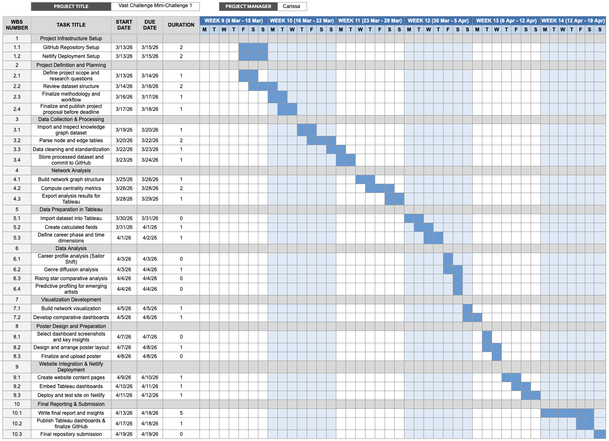

## Introduction/Problem Statement

Sailor Shift, a native of the small island nation of Oceanus, has risen from humble beginnings to become one of the most celebrated artists in contemporary music. Her journey began within the niche genre of Oceanus Folk, a style deeply rooted in the cultural identity of her homeland, before evolving into a globally recognised sound that has captivated audiences worldwide.

In 2023, Sailor joined the Ivy Echoes, an all-female Oceanus Folk band. Although the group disbanded by 2026, it served as the launchpad for Sailor's solo career. Her breakthrough came in 2028 when a single went viral, becoming the first Oceanus Folk song ever to top the global charts. Since then, she has released a new album nearly every year, each one outperforming the last, while also collaborating with established artists in Indie Pop and Indie Folk. This spirit of collaboration is driven by two core passions: (1) spreading the Oceanus Folk genre onto the world stage, and (2) providing a platform for emerging artists to break into the industry. Her influence has had a ripple effect, drawing renewed attention to her former bandmates, all of whom have continued to shape the music world in their own right, and inspiring a new generation of Oceanus Folk artists.

Existing analyses of musical influence are often siloed, focusing on individual artists, individual albums, or narrow time slices, and fail to capture the interconnected web of collaborations, influences, and genre crossovers that underlie Sailor's rise and the broader diffusion of Oceanus Folk. This project addresses this gap. By leveraging a comprehensive dataset encompassing artists, producers, albums, songs, and influence relationships, we aim to unlock the full potential of that dataset and develop interactive visual analytics that reveal Sailor Shift's career development, the spread of Oceanus Folk across the global music world, and the characteristics that define a rising star in today's industry.

## Motivation

The motivation for this project stems from three interconnected needs: journalistic storytelling, cultural documentation, and predictive insight into the music industry.

Firstly, Silas Reed's article *Oceanus Folk: Then-and-Now* requires more than anecdotal accounts of Sailor's rise. To make a compelling and evidence-based case for the cultural impact of Oceanus Folk, Silas needs visualisations that explore a complex dataset intuitively — tracing influence chains, identifying pivotal collaborations, and spotting turning points in the genre's trajectory.

Secondly, cultural value is added when documenting the spread of a small island's musical tradition onto the world stage. Oceanus Folk's journey mirrors broader stories of how regional music cultures are absorbed, transformed, and transmitted globally. Understanding which genres adopted Oceanus Folk elements, which artists acted as bridges, and how the genre itself changed will contribute meaningfully to music history.

Lastly, the music industry will benefit from analysing what distinguishes artists who break through from those who do not. By modelling the career trajectories of Sailor and comparing them with rising Oceanus Folk artists, this project aims to surface actionable patterns that could help emerging musicians make better-informed decisions.

Therefore, this project aims to use visual analytics to transform the dataset into accessible and interactive narratives, providing readers with insights when seeking to understand one of music's most compelling modern stories.

## Dataset

The primary dataset for this project is a knowledge graph assembled by Silas Reed, containing structured relational data on the Oceanus music ecosystem. The graph includes the following entity and relationship types:

| Entity / Relationship Type | Description |
|---|---|
| Artists | Named musicians, vocalists, instrumentalists, and producers active in Oceanus and globally |
| Albums & Songs | Discography records linked to artists and release years |
| Influence Relationships | Directed edges indicating which artists influenced which others, with time context |
| Collaboration Relationships | Edges representing joint works, featured appearances, and production credits |
| Genre Labels | Genre tags associated with artists and works (e.g., Oceanus Folk, Indie Pop, Indie Folk) |
| Producers | Production credits linking songs/albums to producers such as Sophie Ramirez |

**Variables Required:**

- Artist: Unique identifier and name for each musician
- Genre: Primary and secondary genre affiliations over time
- Release Year: Temporal anchoring of albums and songs
- Influence Source / Target: Directional influence relationships between artists
- Collaboration Partners: Co-artists on recorded works
- Popularity / Chart Performance: Where available, commercial success metrics
- Network Position: Derived measures such as degree centrality, betweenness, and PageRank within the influence graph

## Methodology

This project will use Tableau as the primary platform for data analysis and visualization, supplemented by network analysis tools where appropriate. The process is structured in five steps:

**Step 1: Data Collection and Graph Parsing**

- Parse Silas Reed's knowledge graph from its source format (JSON/CSV/GraphML) to extract node and edge tables suitable for Tableau and network analysis.
- Supplement the graph with any publicly available metadata (e.g., genre classifications, chart positions) to enrich the dataset.
- Document the schema and validate completeness — identifying any missing influence edges or artist records that may affect analysis quality.

**Step 2: Data Preparation in Tableau**

- Import node and edge tables into Tableau, establishing artist records as the primary analysis unit.
- Create calculated fields for derived network metrics (e.g., collaboration count, influence in-degree, career span).
- Build time-aware dimensions by segmenting data into career phases: pre-2028 (pre-breakthrough), 2028–2032 (early stardom), and 2033–2040 (established global artist).
- Categorize genres into a simplified taxonomy to enable cross-genre influence analysis.

**Step 3: Data Analysis in Tableau**

- **Career Profile Analysis:** Trace Sailor Shift's full career arc — influences received, collaborations formed, and influence exerted on others — across each career phase.
- **Influence Diffusion Analysis:** Map the spread of Oceanus Folk through the broader music network, identifying which genres and artists acted as conduits.
- **Comparative Rising Star Analysis:** Select three artists at varying stages of career development and compare their trajectory metrics (collaboration rate, influence growth, genre reach).
- **Predictive Profiling:** Apply the rising star characterization to current emerging Oceanus Folk artists to identify the three most likely future breakouts.

**Step 4: Visualization Development in Tableau**

- **Network / Force-Directed Diagrams:** Visualize the collaboration and influence graph with Sailor Shift at the center, color-coded by genre and sized by influence weight.
- **Timeline Charts:** Show the temporal evolution of Sailor's influences, collaborations, and chart performance from 2023 to 2040.
- **Chord Diagrams / Sankey Charts:** Illustrate cross-genre influence flows — how Oceanus Folk influenced other genres and what genres have in turn influenced Oceanus Folk.
- **Comparative Career Dashboards:** Side-by-side visualizations of three selected artists' career trajectories using normalized metrics.
- **Rising Star Radar Charts:** Multi-axis profiles for emerging artists, scored against the characteristics identified in the rising star framework.

**Step 5: Insight Generation and Reporting**

- Publish interactive dashboards to Tableau Public for Silas Reed's use and broader public access.
- Document key findings: inflection points in Sailor's career, the most influential Oceanus Folk conduit artists, and the predicted next generation of stars.
- Produce a written narrative synthesis to accompany the dashboards, suitable for inclusion in Silas's article.

## Tools and Resources

**(A) Primary Tools**

**Tableau Desktop**

Core platform for all data preparation, analysis, and dashboard development. All aspects of data import, cleaning, transformation, analysis, and interactive dashboard creation will be conducted within Tableau Desktop.

**Tableau Public**

For publishing and sharing final interactive dashboards with Silas Reed and the broader public.

**Tableau Prep**

For advanced data cleaning and graph-to-table transformation workflows beyond what Tableau Desktop handles natively.

**(B) Supplementary Tools**

**Gephi or NetworkX (Python)**

For computing network centrality metrics (degree, betweenness, PageRank) to feed back into Tableau as enriched data columns.

**Python (pandas)**

For parsing the knowledge graph source files and preparing edge/node tables.

**(C) Data Sources**

- **Primary:** Silas Reed's knowledge graph dataset (artists, albums, songs, influences, collaborations, producers).
- **Supplementary:** Publicly available music metadata and chart data where applicable to enrich popularity metrics.

## Project Timeline

The Gantt chart below illustrates the project schedule across Weeks 9 to 14, organized into five categories: Brainstorming, Analysis, Deliverables, Submissions, and Consultations.

