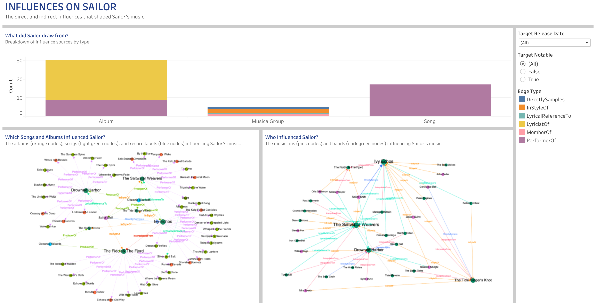
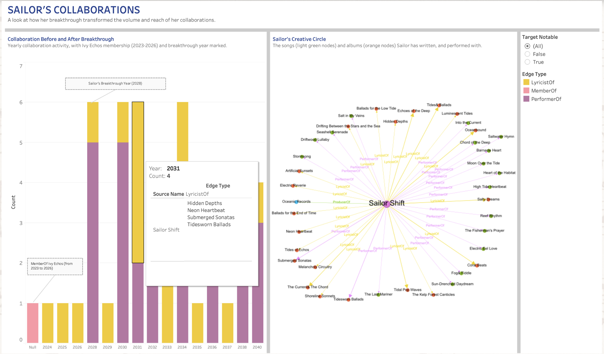
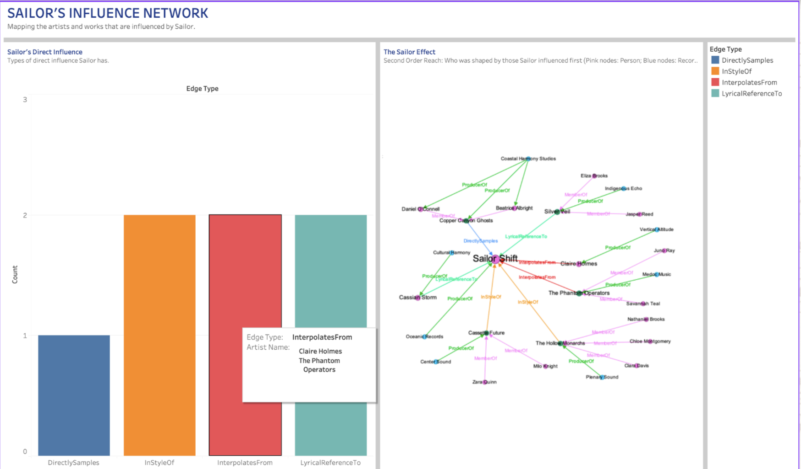
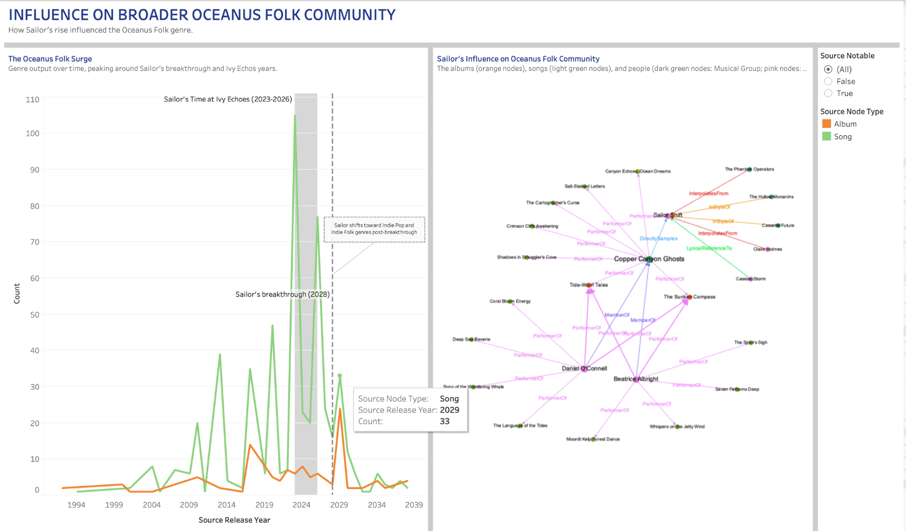

## Influences On Sailor

### Influence Bar Chart
Breakdown of influence sources by type

---

The graph shows that Sailor draws inspiration from a diverse mix of songs, albums, musical groups, and persons, with different influence types (eg. PerformerOf, LyricistOf, DirectlySamples). Albums are the dominant influence source, with around 30 connections, splitting between LyricistOf(yellow, the majority) and PerformerOf (purple). Songs follow as a significant source, with connections almost entirely from PerformerOf (purple), suggesting Sailor was heavily shaped by the performing styles of specific songs. MusicalGroups show the most diverse influence types. The influence types are relating to DirectlySamples (blue), InStyleOf (orange), LyricalReferenceTo (teal), MemberOf (pink), and PerformerOf (purple). This suggests that Sailor's relationship with bands is the most multidimensional. 

By filtering through Target Release Date, the chart reveals how Sailor's influences shift across time. This helps identify which influences had the greatest pull on Sailor's development. After Sailor joined Ivy Echos in 2023, the number of influences increased. 
By filtering through Target Notable, the chart adds a commercial dimension, separating influences that achieved recognition (True) from those that did not (False). This tells us whether Sailor deliberately drew from high-profile works or was shaped by under-the-radar influences that never topped the charts. Sailor drew from a mix of notable and non-notable influences which means that there is more independent artistic sensibility.
Together, the two filters transform the bar chart from a static snapshot into a dynamic tool for understanding the timeline and commercial weight behind Sailor's musical influences. This not only reveals what shaped Sailor, but when and how prominently those influences are in the broader musical landscape.

### Songs and Albums Network Graph
The albums (orange nodes), songs (light green nodes), and record labels (blue nodes) influencing Sailor’s music 

---

<u>Looking at the 1st Network Depth:</u> 

Sailor is LyricalReferenceTo Drowned Harbor, InStyleOf The Saltwater Weavers and The Fiddle & The Fjord, and takes DirectSamples from Ivy Echos. Oceanus Records is the ProducerOf Sailor. Ivy Echos and The Fiddler & The Fjord are the two most heavily connected nodes. They act as primary nodes, meaning they either directly influenced Sailor or serve as connectors between many other songs and albums. The Saltwater Weavers and Drowned Harbor are secondary nodes with notable clusters of songs and albums connected to them via PerformerOf edges.

<u>Looking at the 2nd Network Depth:</u>

We can gain a better understanding of how Sailor has been influenced by the albums and songs relating to the 1st Network Depth. The graph is densely interconnected in the center, with many albums and songs connected to the 1st Network Depth nodes. This suggests that Sailor wasn't just influenced by the musical groups in the 1st Network Depth, but the entire ecosystem of works associated with them.

### People and Musical Groups Network Graph
The musicians (pink nodes) and bands (dark green nodes) influencing Sailor’s music

---

<u>Looking at the 1st Network Depth:</u>

Its insights are the same as the Songs and Albums Network Graph.

<u>Looking at the 2nd Network Depth:</u>

We can gain a better understanding of who Sailor has been influenced by relating to the 1st Network Depth. We can see which musical group or persons InterpolatesFrom, is InStyleOf, or takes LyricalReferenceTo each of the 1st Network Depth nodes. This suggests that Sailor is implicitly absorbing the broader stylistic and lyrical tradition those artists represent and belong to. Therefore, Sailor's musical identity is shaped not just by who she directly drew from, but by the entire relational web of artistic lineage surrounding the 1st Network Depth nodes, making the influences richer, more layered, and more interconnected. 

### Overall Dashboard Analysis
Sailor’s musical identity is not simply a collection of influences, but a continuously evolving system of inspiration. Rather than relying on any single source, she integrates different creative inputs into a cohesive style that reflects both intentional choice and organic discovery. The patterns suggest that her development is shaped by how she utilises the influences, turning them into something uniquely her own rather than directly reflecting them. This shows that Sailor is not just influenced by the musical landscape but actively interprets and redefines it, resulting in a sound that is both grounded in existing traditions and distinctly original.

---

## Sailor's Collaboration

### Collaborations Bar Chart

Yearly collaboration activity, with Ivy Echos membership (2023-2026) and breakthrough year marked

---

<u>Pre-Breakthrough (2024–2027):</u> 

The collaboration counts are low, hovering mostly at 1 per year. LyricistOf activity begins in this period, suggesting she was developing her songwriting identity before her breakthrough. 

<u>Breakthrough Year (2028):</u>

There is a sharp spike, with collaboration count jumping to 6. LyricistOf and PerformerOf both surge simultaneously. Her breakthrough had an immediate effect on her collaborative output. 

<u>Post-Breakthrough (2029–2040):</u>

Collaboration volume sustains at a higher level, with around 4–6 per year compared to the near-zero pre-breakthrough baseline. PerformerOf (purple) becomes the dominant relationship type, suggesting Sailor's post-breakthrough identity is primarily as a performer. LyricistOf (gold) remains consistently present, showing she maintained her songwriting role even as her performing profile grew. There is also no significant drop-off toward 2040, suggesting Sailor's collaborative momentum has been sustained in the long-run.

By filtering through Target Notable, the chart adds a commercial dimension, separating influences that achieved recognition (True) from those that did not (False). This tells us whether Sailor deliberately collaborated with high-profile works or collaborated with under-the-radar influences that never topped the charts. Sailor mainly collaborated for songs or albums that top the charts. This shows that Sailor either actively sought out collaboration with top chart artists or that her growing reputation naturally attracted them.

### Collaborations Network Graph
The songs (light green nodes) and albums (orange nodes) Sailor has written and performed with. 

---

The density and spread of nodes around Sailor Shift reflects extensive and diverse songs and albums from 2023-2040. The network graph’s line thickness suggests Sailor's creative output has a directional bias towards Submerged Sonatas, Tidesworn Ballads, The Current & The Chord, Tidal Pop Waves, Coral Beats, Salty Dreams, Oceanbound, Tides & Ballads, and Echoes of the Deep. She has contributed more to these songs or albums. 

### Overall Dashboard Analysis

---

Sailor’s career is defined by positioning and artistic consolidation rather than just activity levels. Instead of simply increasing songs and albums output, she transitions into a role where her contributions become more central and influential within the broader music landscape. Her collaborations reflect a shift from exploration to clear creative direction, indicating that she has established a recognizable artistic identity that others align with. The patterns across the dashboard also imply that her growth is not temporary, but structurally sustained. Overall, Sailor emerges not just as a participant in collaborations, but as a consistent driver of creative value and industry presence over time.

---

## Sailors Influence Network

### Direct Influence Bar Chart
Types of direct influence Sailor has 

---

Hovering on the Bar Chart, Copper Canyon Ghosts is DirectlySamples of Sailor, Cassette Future and The Hollow Monarchs are InStyleOf Sailor, Claire Homes and The Phantom Operators InterpolatesFrom Sailor, and Cassian Storm and Sliver Veil are LyricalReferenceTo Sailor. The distribution is almost balanced across all four influence types. It tells us that Sailor's influence is not one-dimensional. This breadth of influence shows that Sailor is a truly impactful artist.

### Sailor’s Influence Network Graph
Who was shaped by those Sailor influenced first (Pink nodes: Person; Blue nodes: Record Label; Dark Green nodes: Musical Group)

---

<u>Looking at the 1st Network Depth:</u>

The insights are the same as in the Direct Influence Bar Chart. 

<u>Looking at the 2nd Network Depth:</u>

We can gain a better understanding of who Sailor has indirectly influenced by relating to the 1st Network Depth. We can see which musical group or persons is a ProducerOf or MemberOf each of the 1st Network Depth nodes. These members or producers might not be directly aware of how Sailor shaped the music that shaped them.

### Overall Dashboard Analysis

Sailor’s impact extends beyond direct influence into shaping the structure of the creative ecosystem around her. Rather than influencing in a single clear path, her presence creates ripple effects that influences multiple layers of artists This indicates that her influence has become embedded and self-propagating, where ideas associated with her continue to evolve independently across the network. As a result, Sailor’s significance lies not just in who she directly influences, but in how she contributes to a broader, ongoing cycle of musical evolution, reinforcing her position as a lasting artist within the industry.

---

## Sailor’s Influence On Broader Oceanus Folk Community

### Oceanus Folk Line Chart
Genre output over time, peaking around Sailor’s breakthrough and Ivy Echos years.

--- 

<u>Pre-2020 (Baseline Era):</u>

Oceanus Folk genre output for both songs and albums remains consistently low initially and slowly increases to around 40-50 songs yearly. This shows that the Oceanus Folk genre was a niche, slow-growing community before Sailor's emergence. The occasional green spikes suggest songs were always slightly more active than albums in this genre, but neither showed sustained momentum.

<u>Ivy Echos Period (2023–2026):</u>

There is a sudden surge in song output, reaching the peak of 105 songs. This shows that Sailor's membership in Ivy Echos acted as a catalyst for the entire genre, not just her own career. 

<u>Breakthrough Year (2028) and Post-Breakthrough (2029–2039):</u>

The songs and albums output drops sharply after the Sailor’s breakthrough as she has moved away from Oceanus Folk into Indie Pop and Indie Folk. The genre loses its primary engine of growth and returns toward lower, more sustainable output levels. However, output does not fully return to pre-2020 baseline levels, suggesting Sailor's influence left a permanent impact on the genre's overall activity. 

By filtering through Source Notable, the chart adds a commercial dimension, separating influences that achieved recognition (True) from those that did not (False). This tells us whether Oceanus Folk genre consists of high-profile works or under-the-radar works that never topped the charts. Oceanus Folk genre songs or albums mainly top the charts. This shows that the Oceanus Folk genre is doing well and people enjoy listening to it.

### Sailor’s Influence on Oceanus Folk Network Graph
The albums (orange nodes), songs (light green nodes), and people (dark green nodes: Musical Group; pink nodes: Person) which Sailor influenced.

---

<u>Looking at the 1st Network Depth:</u>

Cassian Storm is LyricalReferenceTo Sailor, The Hollow Monarchs and Cassette Future are InStyleOf Sailor, Claire Holmes and The Phantom Operators InterpolatesFrom Sailor and Copper Canyon Ghosts takes DirectSamples from Sailor. Copper Canyon Ghosts emerges as the second major hub, with a number of songs and albums that it is a PerformerOf 

<u>Looking at the 2nd Network Depth:</u>

We can gain a better understanding of who Sailor has indirectly influenced in the Oceanus Folk community by relating to the 1st Network Depth. Daniel O'Connell and Beatrice Albright form a secondary influence tier, each connected to multiple songs and albums via PerformerOf edges. This indicates that they are active members of the community who have absorbed Sailor's musical impact. 

The graph features a rich diversity of edge types throughout - purple (MemberOf), pink (PerformerOf), orange (InStyleOf), red (InterpolatesFrom), green (LyricalReferenceTo) - highlighting that Sailor's influence on the Oceanus Folk community operates across every possible relational dimension. 

### Overall Dashboard Analysis

Sailor’s role in Oceanus Folk reflects her influence on the genre’s trajectory and identity. Rather than simply contributing to its growth, she acts as a pivotal force that reshapes how the genre evolves, leaving behind benefits that persist even after she switched her genre focus elsewhere. The patterns suggest that her impact is enduring, creating momentum that other artists continue to build upon while redefining the creative direction of the space. This positions Sailor not just as a key artist within Oceanus Folk, but as someone whose presence reconfigures the genre’s long-term development and legacy.
