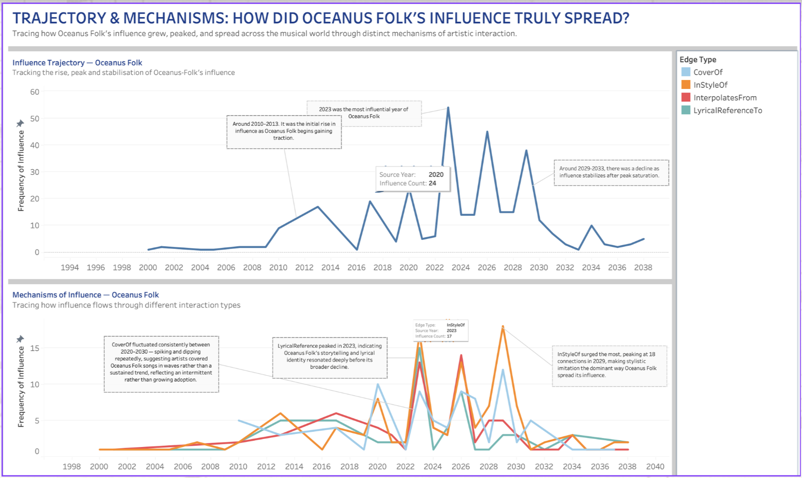
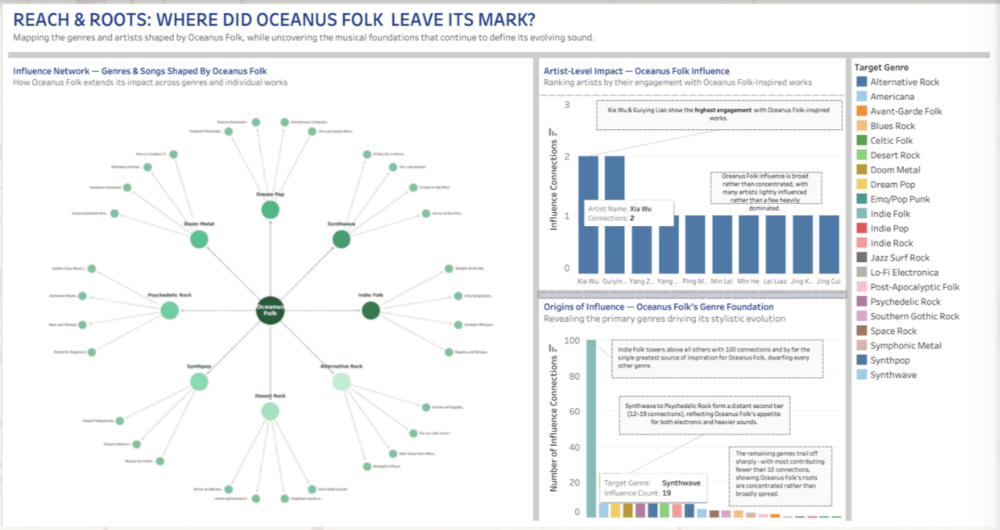
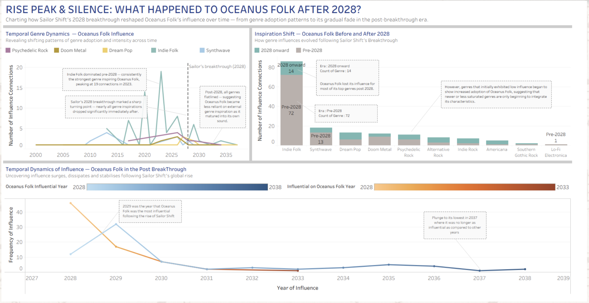

## Oceanus Folk Influence Spread

### Influence Trajectory Line Chart
How did Oceanus Folk’s influence evolve over time, and what factors might explain its rise, peak, and eventual decline?

---

The Influence trajectory line chart depicts how Oceanus Folk rises, peaks, and settles into a more stable phase from the mid-1990s to 2038. From the mid-1990s to 2010, the line was quite flat, suggesting the genre hadn't really grown much or had very low visibility. However, around 2010–2014, there was a rise in the numbers of influence pointing to early adoption, probably when a few artists or scenes started pushing the sound into wider circulation.

From 2017-2023, there were multiple occurrences of dip and spikes. This probably occurred due to viral releases, standout albums, or influential artists pulling the popularity of the genre. The peak occurred in 2023 when Oceanus Folk shined the most. However, a drop in the number of influences occurred afterwards but the overall drop is normal especially in the music industry due to the loss in freshness of the genre. By the 2030s, the line flattened again, and not to zero but more likely the genre has settled into a niche, still present but no longer leading trendy genre.

### Mechanisms of Influence Line Chart
Through which mechanisms did Oceanus Folk spread its influence, and how did the importance of these mechanisms change over time?

---

The mechanism of influence line chart explains how that influence actually spread. Early on, all four mechanisms are pretty quiet, reinforcing that initial adoption required deliberate discovery rather than passive exposure. As things pick up after 2010, more activities can be seen across the board, but each pathway behaves a bit differently. CoverOf stays relatively steady, which suggests people were consistently engaging with existing Oceanus Folk tracks rather than constantly reinventing them. It’s less explosive, more sustained. 

LyricalReferenceTo builds more gradually and peaks around 2023, which feels important—it shows that the themes or ideas behind the genre were resonating, not just the sound.
The most noticeable change is in InStyleOf, which spikes much later and more sharply. This probably occurred due to the genre becoming more familiar enough that artists can imitate it without referencing specific songs. At that point, it’s not just influence—it’s identity. 

InterpolatesFrom comes and goes in bursts, suggesting selective borrowing rather than widespread use. After the late 2020s, everything tapers off, which lines up with the idea of saturation.

### Overall Dashboard Analysis

Oceanus Folk’s success was more of a gradual buildup rather than a single breakthrough. The peak around 2023 likely represents a moment where multiple factors converged such as audience demand, artist experimentation, and algorithmic amplification. However, the same factors also declined towards the end, especially the heavy imitation InStyleOf caused saturation, making the genre feel less unique and impactful over time shifting both artists and listeners perspective. Despite all these occurrences, Oceanus Folk didn’t really disappear completely from the map but it transitioned into a background influence. Its continued presence in covers, references, and stylistic echoes shows it achieved something more lasting than trend status.

---

## Oceanus Folk's Footprint

### Influence Network of Genres and Songs Chart 
How does Oceanus Folk spread its influence across different genres and songs, and why does it have a stronger impact on some genres than others?

---

The Influence Network Chart depicts how Oceanus Folk was able to spread itself into other genres and individual works, with Oceanus Folk sitting at the center of the network. The genre that stands out most in the chart is Indie Folk which has noticeably more links due to the darker node, suggesting that it absorbs a larger share of the influence. This likely happened due to Oceanus Folk sharing similar acoustic styles and themes with Indie Folk, allowing its elements to easily spread the genre. Other genres, like Synthwave or Dream Pop are influenced by Oceanus Folk but only in small ways over overall style. 
The Influence Network Chart is also made up of big and small nodes. The smaller nodes, which represent individual songs, tend to appear more frequently, suggesting influence happens gradually at the track level rather than through major genre-wide shifts.

Instead of reshaping entire genres, Oceanus Folk influences genres through individual songs, accumulating influence and building its impact over time. The genre spreads widely, but it tends to take hold strongly in genres that had already aligned with its sound, rather than transforming completely different ones.

### Artist Level Impact Bar Chart
How is Oceanus Folk’s influence distributed among artists, and what does this suggest about whether the genre is driven by key individuals or collective adoption?

---

The artist level impact chart looks at how individual artists engage with Oceanus Folk. The most noticeable thing is how closely grouped the values are. Most artists sit within a narrow range, with only small differences between them, and even the highest values don’t stand far above the rest. This shows that there isn’t a single dominant artist pushing the genre forward. Instead, influence is spread across many artists, each contributing at a similar level. This probably happened due to the genre being widely accepted, rather than being driven by a few key trendsetters. It suggests that Oceanus Folk isn’t tied to specific names, but instead exists as a shared pool of ideas that many artists independently adopt similar stylistic elements which explains how the genre becomes recognizable over time.

###  Origins of Influence Bar Chart 
Which genres contribute most to the formation of Oceanus Folk, and what does this reveal about its core identity and stylistic foundation?

---

The Origin of Influence Chart flips the perspective and looks at where Oceanus Folk comes from, and here the pattern is much more concentrated. Indie Folk can be seen dominating the analysis with far more connections than any other genre. This suggests that Oceanus Folk is built on a strong core foundation and likely inheriting its acoustic textures, storytelling style, and overall aesthetic from Indie Folk.
However, genres like Synthwave or Psychedelic Rock still show some possible influence to Oceanus Folk, but at lower levels. This probably happened due to Oceanus Folk taking some inspirations from the genre’s elements such as atmospheric layers or experimental sounds, rather than shaping the genre’s core identity. However, the sharp drop from Indie Folk also proves that Oceanus Folk likely took almost all its inspirations from a single primary source.

In contrast to the first chart, Oceanus Folk draws from a narrow base but spreads outward much more widely, suggesting it takes a clear, established sound and adapts it across different contexts, rather than constantly reinventing itself from multiple influences.

### Overall Dashboard Analysis
Oceanus Folk comes across as a genre with a strong foundation of influence from Indie Folk. The foundation also gives it the ability to branch out naturally into different but related genres and artists. This combination of stable foundation and adaptable edges makes it easy to spread without losing its identity and makes it feel less like a short-lived trend and more like a shared creative approach. Additionally, With such an influential style, growth tends to be more steady and organic rather than sudden spikes. However, the genre can be at a saturation risk when many artists adopt similar elements due to songs coming out as being too similar, forcing the genre to start losing its distinctiveness. However, even though such things happens, the wide spread of influence suggests it doesn’t disappear but simply blends into the background, continuing to shape music in more subtle and lasting ways.

---

## Oceanus Folk Influence Spread

### Temporal Genre Dynamics Line Chart
How do the genres influencing Oceanus Folk change over time, and what does this suggest about its development before and after the 2028 breakthrough?

---

The Temporal Genre Dynamics Line Chart depicts how genres that once influenced Oceanus Folk had changed over time, especially during the 2028 breakthrough. Before 2028, Indie Folk clearly dominated, consistently showing the highest number of influence connections and capturing the peak around 2023. This suggests that Oceanus Folk was heavily reliant on Indie Folk as its core inspiration during its early and peak phases. Other genres like Synthwave and Dream Pop appear, but at much lower levels, indicating they played supporting roles rather than shaping the genre.
However, after 2028, there is a noticeable drop across all genres. The lines flatten significantly, showing that Oceanus Folk becomes less dependent on external genre influences. This likely reflects a shift where the genre matures and develops its own identity instead of drawing heavily from others. However, the decline may also suggest a decline in innovation, as fewer new influences are being integrated. Overall, the chart highlights a transition from strong external inspiration to a more self-contained but less dynamic phase.

### Inspiration Shift Stacked Bar Chart
How genre influences evolved following Sailor Shift’s Breakthrough?

---

Inspiration Shift Stacked Bar Chart compares how different genres influence Oceanus Folk before and after 2028. Before 2028, Indie Folk dominated the influence for Oceanus Folk with significantly higher connections than any other genre during its rise. However, after 2028, the overall number of connections drops sharply across nearly all genres. Even the genre Indie Folk that influenced Oceanus Folk sees a major decline, suggesting that its influence weakened significantly in the post-breakthrough period. While some genres depicts minimal increases in adoption after 2028, they are relatively small and do not compensate enough for the overall decline. The variation in the bar charts also suggests that Oceanus Folk lost much of its external inspiration after its peak. Rather than continuously evolving through new influences, it became more static and no longer actively shaped by other genres, reducing impact over time.

### Temporal Dynamics of Influence Line Chart
How does Oceanus Folk’s influence change after 2028, and what explains the rise and decline in its popularity over time?

---

The Temporal Dynamics of Influence Line Chart depicts how Oceanus Folk’s influence changed after 2028. Something that stands out is the sharp rise in Oceanus Folk’s influence around 2029, where the genre reaches its highest level of influence after Sailor Shift’s breakthrough. This may have happened due to Sailor Shift bringing strong attention to the genre which was likely introduced to a wider range of audience to artists and listeners through engagements. However, Oceanus Folk’s popularity didn’t last long. After 2029, the influence dropped rapidly, reaching very low levels by 2031, suggesting that the attention gained was temporary. For the next 4 years, the trend remains relatively flat, with small and minimal fluctuations. A slight rise appeared again in 2035, but not significant enough to indicate a real recovery. By 2037, the influence reaches one of its lowest points, proving that Oceanus Folk is no longer as impactful. Overall, the chart reflects a typical post-peak pattern, where it was once successful,  followed by a steady decline and no longer as impactful.

### Overall Dashboard Analysis
Oceanus Folk experienced a radical change after 2028, moving from a highly influenced and dynamic genre into a more stable then towards the declining phase.  Before the breakthrough, it relied heavily on Indie Folk and other genres for inspiration to drive its growth and development. 2028 was the breakthrough turning point that minimally boosted its influence and visibility but it was short-lived. External influences of genres to Oceanus Folk also declined significantly, along with its reduced activity in shaping the wider music landscape. In summary, it can be concluded that Oceanus Folk has reached a point of maturity and saturation, where it no longer evolves but settles into a quieter phase. While it did not disappear completely, its role shifts from being a leading influence to a more background presence in the music ecosystem.

