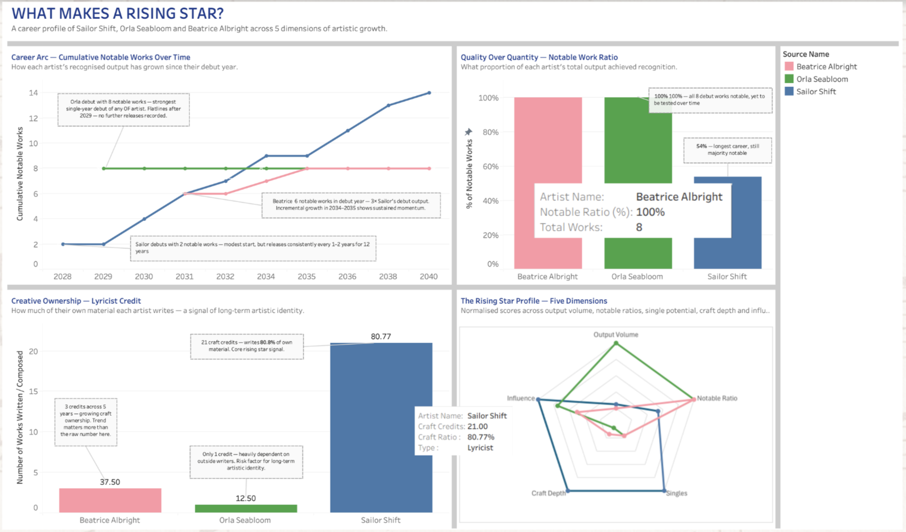
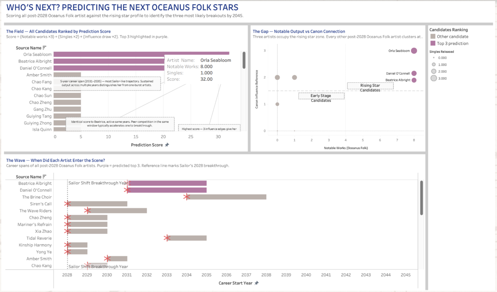
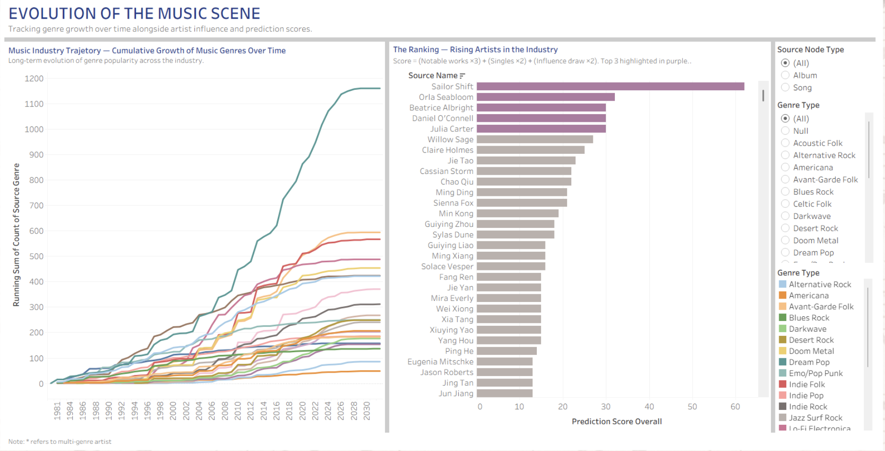

## What Makes a Rising Star in the Music Industry?

### Career Arc Line Graph
How has each artist’s recognised output grown over time?

--- 

Sailor Shift shows the benchmark rising star trajectory — a steady upward climb from 2 notable works in 2028 to 14 by 2040, releasing consistently every 1–2 years with no gaps longer than 2 years. This sustained momentum across 12 years is what defines a true rising star versus a one-album wonder. Orla Seabloom's line reveals the opposite pattern — an explosive debut of 8 notable works in 2029 which is impressive; however it was followed by a complete flatline reveals the risk of a burst-and-disappear pattern. Beatrice Albright sits between these two — a strong debut of 6 notable works in 2031, incremental growth in 2034–2035, then silence. Her trajectory most closely mirrors Sailor's early years, making her the most credible comparison subject. The key insight is that the shape of the line matters more than where it ends: a gradual upward slope signals a sustainable career, while a spike followed by a flat line signals an artist who has not yet proven longevity.

### Notable Ratio Horizontal Bar Chart
What proportion of each artist’s total output achieved recognition?

---

Orla and Beatrice both score 100% notable ratio — every work they released achieved recognition. However, this should be interpreted with caution. Orla's 100% comes from 8 works released in a single debut year with no further releases recorded, meaning her ratio has never been stress-tested over time. Beatrice similarly achieves 100% across a small concentrated output window before activity slows. A perfect ratio on a small, short burst of releases is easier to maintain than sustaining notability across a long, active career. Sailor scores 53.8%, which is the harder achievement — maintaining over half her works as notable across 26 releases spanning 12 years of consistent output is a far stronger signal of sustained artistic relevance than a frozen 100% that was never challenged again.

### Craft Depth
Does each artist write their own material and what type?

---

Craft depth is the dimension where Sailor most clearly separates from the other two. Sailor Shift has 21 craft credits — she writes 80.8% of her own performed material, spanning both composition and lyrics means her music carries a consistent creative voice. This creative ownership is a key differentiator: artists who control their own songwriting build a distinct voice that audiences recognise and follow across a long career. Orla's 12.5% ratio (1 craft credit) is the weakest signal in her profile: an artist who does not write their own material is heavily dependent on collaborators to define their sound, which makes sustained career growth harder. Beatrice's 37.5% (3 craft credit) shows she is investing in creative ownership. The trajectory from 12.5% to 80.8% is achievable, but it requires deliberate growth.

### Radar Chart
How does each artist score across all 5 rising star dimensions? 

---

The radar chart synthesises all five dimensions into a single visual. Sailor Shift's polygon is the most balanced — strong across singles (100), craft (100), and influence (100), with moderate output volume (25) and notable ratio (54), confirming her position as the benchmark rising star who combines viral breakout potential, creative ownership, and broad industry connectivity. Orla Seabloom leads on output volume and notable ratio, demonstrating exceptional debut quality, but her lower craft ratio and network influence score suggest she is still building the infrastructure for a sustained career. Beatrice Albright presents the most balanced emerging profile — strong notable ratio, growing craft ownership, and moderate network influence — making her trajectory most comparable to Sailor's early career arc. While Orla's quality metrics are impressive, Beatrice's balance across all five dimensions more closely mirrors the profile of an artist positioned for long-term rising star status.

<u>Explanation on the 5 dimensions:</u>

Output volume — Is this artist building a career, or did they just show up? Measures years of active releases. The purpose isn't to reward prolific artists — it's to filter out one-moment artists. Sustained output is the baseline signal of long-term commitment.

Notable ratio — When they release, does it land? Measures what proportion of works achieved recognition. A 100% notable ratio signals strong creative judgment. On its own it can be misleading — one lucky song scores perfectly — which is why it only means something when read alongside output volume.

Singles and viral moments — Has this artist broken through publicly, not just critically? Notable works can stay inside an OF bubble. A viral single crosses a different threshold entirely — it's the ignition event that moves an artist from "respected locally" to "known globally." This dimension is most directly tied to Sailor's own story.

Craft depth — Does this artist own their creative identity, or are they executing someone else's? Measures composer, lyricist, and producer credits beyond just performer credits. Artists who write and produce their own work have a distinct voice that persists over time. Artists with only performer credits are dependent on collaborators, making their trajectory far less predictable.

Influence draw — Is this artist genuinely part of the OF tradition, or just adjacent to it? Measures how deliberately an artist references or draws from existing OF works. Without this dimension the framework would identify any rising star in any genre. This is what makes the scoring OF-specific — rewarding artists who are consciously carrying the tradition forward.

Together, the five dimensions cross-check each other across three career phases: craft depth and influence draw describe the foundation built before anyone is paying attention; output volume and notable ratio describe the momentum of the build-up; singles capture the ignition event that converts momentum into mainstream recognition. A high overall score requires strength across all three phases simultaneously — which is rare, and exactly what makes it a reliable filter for predicting the next OF star rather than just identifying who is good right now.

### Overall Dashboard Analysis
Across all four charts, a consistent profile of a rising star emerges: sustained output over multiple years (not a single burst), a high proportion of recognised works, creative ownership through self-writing, and deliberate roots in the genre canon. Sailor Shift scores highest on craft depth, singles output, and influence draw — the three dimensions most associated with long-term career sustainability. Orla Seabloom scores highest on raw quality metrics but has yet to demonstrate the sustained output that would confirm her as a rising star rather than a debut phenomenon. Beatrice Albright's trajectory most closely mirrors Sailor's early career shape, making her the most analytically credible comparison subject.

---

## Who are the Next Oceanus Folk Rising Stars?

### Prediction Score Bar Chart
Who scores highest across all post-2028 Oceanus Folk artists?

---

The prediction score bar immediately reveals a dramatic gap between the top 3 and the rest of the field. Orla Seabloom leads with 32, Beatrice Albright and Daniel O'Connell follow at 30, and every other post-2028 Oceanus Folk artist scores 5 or less. This is not a marginal prediction — the top 3 are categorically separated from the field by a factor of 6. The reference line at 26 marks the threshold above which an artist has demonstrated both sustained notable output and meaningful canon connections. Only three artists cross it.

<u>Why these three dimensions were chosen?</u>

The formula uses Notable Works, Singles, and Influence Draw — and deliberately excludes Output Volume and Craft Ratio. Here is the reasoning for each decision: 

Notable Works × 3 — highest weight
Notable works is the closest proxy to demonstrated market validation in the dataset. A work marked notable has already proven it resonated beyond just being released — it achieved recognition. The weight of 3 reflects that sustained quality output is the single strongest predictor of rising star status. One notable work could be luck. Multiple notable works across a career signals repeatable craft. An artist who consistently produces recognised work has already demonstrated the core requirement of stardom — the ability to connect with an audience.

Singles × 2 — medium weight
Singles represent intentional breakout attempts — the artist and their team believed a specific work had viral or radio potential and positioned it accordingly. A single is a strategic signal, not just an output metric. Weight of 2 reflects that singles matter but are secondary to overall notable output. A single can be released and fail. A notable single that succeeds is already captured by the Notable Works dimension. Singles here specifically rewards the strategic behaviour of attempting a breakout, which is a necessary step in the rising star trajectory even if the outcome is uncertain.

Influence Draw × 2 — medium weight
Influence draw measures how deeply an artist roots their work in the existing genre canon — through covers, interpolations, style references, lyrical references, and direct samples. For Oceanus Folk specifically, this signals genre authenticity and community belonging. Artists who reference the canon are signalling to existing fans and gatekeepers that they understand and respect the tradition. Weight of 2 reflects that genre authenticity is important for niche genre stardom but is not the primary driver of mainstream success.

<u>Why Output Volume and Craft Ratio were excluded?</u>

Output Volume measures career infrastructure — how consistently an artist releases. This is important for the rising star profile (Dashboard 1) but is a leading indicator of future potential rather than evidence of current trajectory. An artist can release prolifically with zero notable works. Volume without quality does not predict stardom.
Craft Ratio measures creative ownership — the percentage of performed works the artist also wrote. Again important for long-term sustainability but not directly predictive of near-term breakthrough. An artist can write all their own material and remain completely unknown. Craft ratio rewards process, not outcomes.

### Rising Star Scatter Plot
Do the top 3 stand apart from all other candidates on the two most important dimensions?

---

The scatter plot provides visual confirmation that the top 3 predictions are not borderline calls. Every other post-2028 Oceanus Folk artist sits in the bottom-left quadrant — one notable work, zero influence edges. The three predicted stars occupy the top-right rising star zone completely alone. The dot size adds a third dimension: all three predicted stars have released at least one single (larger dots), while the gray cluster is made up of tiny dots with no single releases. This three-dimensional separation across notable output, canon connection, and singles releases makes the prediction analytically robust.

### Gantt Chart
Does breakthrough year relative to Sailor’s breakthrough matter?

---

The Gantt chart reveals that timing of entry is a meaningful differentiator. Beatrice Albright and Daniel O'Connell both entered the scene right at Sailor's 2028 breakthrough year, positioning them to ride the wave of global attention that Sailor's viral single generated — their longer career bars extending toward 2035 confirm they sustained momentum rather than burning out early. Most other candidates entered before 2028 but show short career spans, suggesting they emerged too early to benefit from Sailor's influence and failed to maintain activity long enough to break through. The red star markers scattered across several artists indicate notable single releases mid-career, and the top 3 predicted stars each carry at least one of these markers, reinforcing that a well-timed single within an already-active career is a consistent pattern among breakout candidates.

### Overall Dashboard Analysis
Dashboard 2 takes the rising star benchmark established in Dashboard 1 and stress-tests it against every post-2028 Oceanus Folk artist to produce a data-driven prediction of who breaks out next. The three charts work together as a funnel — the ranking bar chart identifies who scores highest, the scatter plot confirms those same three artists are genuinely separated from the field on the two most critical dimensions, and the Gantt chart validates that their career timing aligns with the window of opportunity created by Sailor's breakthrough. Orla Seabloom, Beatrice Albright, and Daniel O'Connell score well, occupy the rising star zone exclusively, and entered the scene at the right moment to capitalise on Sailor's growing global influence. Every other candidate fails on at least one of these three dimensions, making the separation between the top 3 and the rest of the field not a close call but a consistent pattern across all three lenses of analysis.

---

## Overall in the Music industry

### Music Industry Trajectory Line Chart
Which genres have grown and which have stagnated?

---

The line chart spanning 1981 to 2032 shows one genre pulling dramatically away from the rest — the teal line representing Dream Pop surges past 1,100 by 2032, accelerating sharply after 2016 while all other genres grow at a far more gradual pace. Most genres cluster between 100 and 600, showing steady but unremarkable growth. A handful of genres remain flat near the bottom throughout the entire period, never gaining significant industry traction. The chart makes clear that genre growth is not linear or uniform — breakout moments exist where a genre suddenly accelerates, often coinciding with a breakthrough artist driving mainstream attention toward it. Oceanus Folk's own trajectory, while not the dominant line, shows a visible uptick correlating with Sailor's 2028 breakthrough.

### The Ranking Bar Chart
Where does every artist stand?

---

Sailor Shift's bar stands alone at over 60, creating a visible gap between her and every other artist in the industry. The next tier — Orla Seabloom, Beatrice Albright, Daniel O'Connell, and Julia Carter — clusters between 28 and 32, highlighted in purple as the top predicted breakouts. Below them, the remaining artists form a long grey tail scoring under 25, confirming that genuine breakout potential is rare and concentrated in a small group. The chart also confirms that Sailor's score is not just the highest — it is categorically in a different tier, validating her status as the benchmark ceiling against which all rising artists are measured.

### Overall Dashboard Analysis
Dashboard 3 zooms out from the Oceanus Folk focus of Dashboards 1 and 2 to place everything in full industry context. It confirms two things simultaneously: that certain genres experience explosive growth driven by breakthrough moments rather than gradual accumulation, and that Sailor Shift's dominance is not just an Oceanus Folk story but an industry-wide phenomenon. The combination of the genre trajectory chart and the ranking chart together show that Sailor did not simply rise within Oceanus Folk — she pulled an entire genre upward with her, and the next wave of artists most likely to replicate that pattern are already identifiable through their scores, their genre positioning, and the timing of their entry into the scene.
