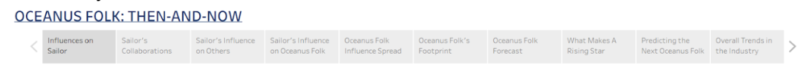

A visual analytics and storytelling project designed to trace the rise of Sailor Shift, map the global diffusion of Oceanus Folk, and identify the next generation of breakout artists through interactive dashboards built on a music knowledge graph collected by journalist Silas Reed.

# User Flow Overview
The dashboards follow a deliberate narrative arc moving from the individual, to the genre, to the industry.

# Dashboard Story Flow Structure
<ul>
<li> **The Sailor Shift Journey:** Explore Sailor's influences, collaborations, and the ripple effects of her rise </li>
<li> **The Rise of Oceanus Folk:** Track how the genre spread, who it touched, and where it is heading </li>
<li> **The Next Generation:** Benchmark what a rising star looks like and predict who carries the Oceanus Folk legacy forward</li>
</ul>

# Section 1: The Sailor Shift Journey
Purpose: Profiling Sailor Shift's career, collaborations, and influence on the Oceanus Folk community

| Dashboard | View | Key Metric | Chart Type |
|---------|--------|---------|--------|
1|Influences on Sailor|Influence edges by artist and genre, Direct and indirect influence edges| Bar Chart,  Network Graph|
|2|Sailor’s Collaborations|Collaboration frequency| Bar Chart,  Network Graph|
|3|Sailor’s Influence on Others|Direct and indirect influence edges| Bar Chart,  Network Graph|
|4|Sailor’s Influence on Oceanus Folk|Oceanus Folk genre change| Line Chart,  Network Graph|

## Dashboard Description
Influence on Sailor: Mapping the artists, genres, and works that shaped Sailor's musical identity and creative direction
Sailor's Collaborations: Visualising which albums and songs Sailor has worked on directly and how frequently
Sailor's Influence on Others: Tracing the direct and indirect effects of Sailor's work on other artists, showing how her collaborations seeded influence beyond her immediate network
Sailor's Influence on Oceanus Folk: Examining how Sailor's breakthrough transformed the Oceanus Folk genre itself and the artists, songs, and albums she inspired

## Key Questions Answered
<ul>
<li>Who and what shaped Sailor's sound before, during, and after her breakthrough?</li>
<li>Which songs or albums were she a performer of or lyricist of?</li>
<li>How far did her influence travel directly and indirectly?</li>
<li>How did her success transform the Oceanus Folk community?</li>
</ul>

---

# Section 2: The Rise of Oceanus Folk
Purpose: Tracing how a small island genre became a global musical force

| Dashboard | View | Key Metric | Chart Type |
|---------|--------|---------|--------|
|5|Oceanus Folk Influence Spread|Frequency of influence edges over time by interaction type|Line Chart, Multi-Line Chart|
|6|Oceanus Folk’s Footprint|Genre network reach, artist engagement, Outbound genre origins|Network Graph, Bar Chart|
|7|Oceanus Folk Forecast|Genre adoption pre vs post 2028, temporal influence dynamics|Grouped Bar, Line Chart|

## Dashboard Description
Oceanus Folk Influence Spread: Tracking the rise, peak, and stabilisation of Oceanus Folk's influence frequency from 2000 to 2038, and breaking down how that influence flowed through distinct interaction mechanisms and identifying which genres absorbed Oceanus Folk's influence most strongly
Oceanus Folk's Footprint: Mapping which genres and individual songs Oceanus Folk reached through a network graph, ranking the artists most engaged with Oceanus Folk-inspired works, and uncovering which genre is the greatest source of inspiration feeding back into Oceanus Folk itself
Oceanus Folk Forecast: Projecting the genre's trajectory based on current momentum, collaboration density, and the pipeline of emerging artists carrying the Oceanus Folk sound forward. Charting how Sailor Shift's 2028 breakthrough reshaped Oceanus Folk's influence trajectory showing which genre dominated pre-2028 genre inspirations.

## Key Questions Answered
<ul>
<li>Was Oceanus Folk's rise gradual or triggered by a single breakthrough moment?</li>
<li>Which edge type drove the most influential connections?</li>
<li>Which genres and artists were most shaped by Oceanus Folk?</li>
<li>Which genres fed most strongly back into Oceanus Folk's own evolving sound?</li>
<li>How did Sailor's 2028 breakthrough change the genre's relationship with external influences?</li>
</ul>

---

# Section 3: The Next Generation
Purpose: Building a rising star profile and predicting who breaks out next

| Dashboard | View | Key Metric | Chart Type |
|---------|--------|---------|--------|
|8|What Makes a Rising Star|5-dimension normalised profile across 3 benchmark artists|Radar Chart, Line Chart, Bar Chart
|9|Predicting the Next Oceanus Folk Star|Composite prediction score, career timing, influence gap|Bar Chart, Scatter Plot, Gantt Chart
|10|Overall Trends in Music Industry|Cumulative genre growth, industry-wide artist ranking|Multi-line Chart, Ranked Bar Chart

## Dashboard Description:
What Makes a Rising Star: Profiling Sailor Shift, Orla Seabloom, and Beatrice Albright across five dimensions to construct a data-driven benchmark template of what artistic breakout looks like
Predicting the Next Oceanus Folk Star: Applying the rising star benchmark to all post-2028 Oceanus Folk artists to identify the three most likely breakouts by 2045 with confidence across multiple analytical lenses
Overall Trends in Music Industry: Placing Sailor's dominance and Oceanus Folk's rise in full industry context across four decades of genre growth, confirming the genre's measurable impact on the global music landscape

## Key Questions Answered
<ul>
<li>What dimensions define a rising star across output, craft, and influence?</li>
<li>Which three post-2028 Oceanus Folk artists are most likely to break out by 2045?</li>
<li>How does Oceanus Folk's growth compare to all other genres across four decades?</li>
</ul>

<!-- 
## Scene 1: Landing Page

**User Goal:** Understand the overall summary at a glance.

**What the user sees:** A high-level dashboard with key metrics and filters.

---

## Scene 2: Exploratory View

**User Goal:** Drill down into a specific category or time period.

**What the user sees:** Interactive charts that respond to filter selections.

---

## Scene 3: Comparative Analysis

**User Goal:** Compare two or more groups side-by-side.

**What the user sees:** A split-panel view with synchronized tooltips.

---

## Scene 4: Insights & Export

**User Goal:** Extract insights and share findings.

**What the user sees:** A summary panel with download/export options. -->
